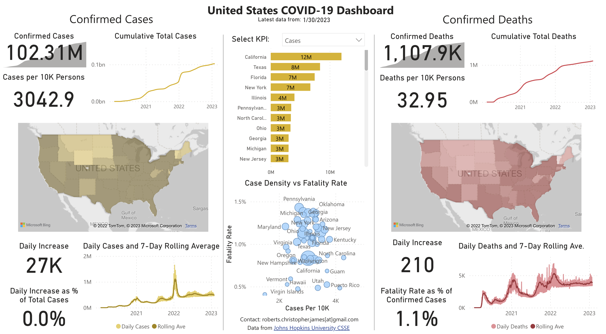

## Getting started

My first post here is a collection of old BI projects.  I wavered on whether or not to post these because they are no longer representative of my current work, but in the end I felt like it could be useful for early career analysts to see how another data professional has developed over the years.  In that spirit, I'll critique each of these projects with an eye to what I would do differently if I were starting the project again from scratch.

## Projects

### Obligatory COVID Tracking Dashboard
First up is a [COVID tracking dashboard](https://bit.ly/2HpCCLF) made when COVID infections in the United States were still in the range of a few hundred cases.  

This was one of my first projects in Power BI, and it actually turned out much better than I originally thought it might.  Time, the trajectory of caseloads, and some Power BI Service updates have not been kind to it, however, and there are several things I'd do differently if I were to start again including:

 - Not trying to fit everything onto one page.  Clearly, this has resulted in a crowded and visually overloaded dashboard with visualizations and data points nearly on top of one another.  A simple way to nearly double the real estate here would be to use a toggle to switch between cases and deaths KPIs
 - Use more appropriate font sizes.  Yeesh -- enough said!
 - For the maps, use conditional formatting rules that weather the increase in cases much more flexibly.  In order to make them look most appealing at the time, I used hard-coded values to determine the shading of the filled maps.  Definitely not ideal.
 - Include far more context for key metrics.  For example, since we're looking at national values, it could be really useful to compare how the U.S. is doing relative to other nations.

There are several things that I like and appreciate about this original project, however, and I don't want to spend the whole post being hard on my former self. Despite not using a moving window, I really like that I implemented a rolling average while retaining the actual daily values in the bottom-most charts.  I haven't posted the `.pbix`, but looking at it I also can appreciate that I took care to have a nicely documented process with consistent naming for measures and the like.  Finally, I'm glad that I used color sparingly and consistently and took care with the more hidden bits like tooltips.

### COVID Journal Publications Dashboard
More Power BI and more COVID in [this dashboard](https://bit.ly/3GKvsuq) that allows the user to explore journal articles published on COVID.  

- Data Studio (Looker studio) project
    https://bit.ly/33U9PHx