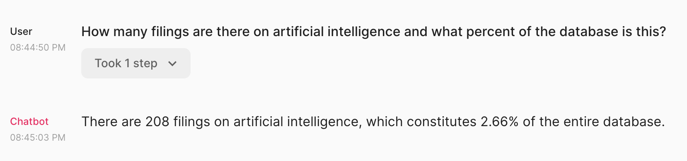

## Getting Started

First off, here is the [link to the chatbot](https://chainlit-gcp-image-rpq46mxeua-uc.a.run.app/)!

It allows the user to query a knowledge graph of one week's worth of USPTO patent applications from early 2023 by providing a natural language interface.

I want to give credit where it's due for the inspiration for this project.  Last week at GraphSummit Minneapolis, I saw [Michael Moore](https://www.linkedin.com/in/michaeldmoore) and [Phani Dathar](https://www.linkedin.com/in/gopi-dathar) each give a presentation with demos of a retrieval-augmented generation, or RAG, system that queried a knowledge graph using natural language.  The large language model (LLM) generated Cypher code that queried a Neo4j database to ultimately provide a conversational interface with graph data. This is one way to overcome the current limitations of LLMs by providing access to up-to-date and potentially private data, though one certainly has to be careful where that data is sent if data privacy is a primary concern.  

At the same time, I'd been looking for a way to hone some of my burgeoning graph data modelling skills.  Naturally, with my background in patent data, the logical thing to do was to combine all of my interests and build a RAG system on top of Neo4j database containing patent data.  [Bulk USPTO data](https://www.uspto.gov/learning-and-resources/bulk-data-products) here we come!

## Standing up the database

### Loading the data
The full data model for the database I built is pictured at the top of this post. I have to apologize to both graph database afficionados and patent data experts here -- I didn't do any entity resolution on assignees or inventors, and I ignored patent classes altogether.  

The steps to creating the database involved:

1) downloading bulk USPTO [XML of 2023 patent applications](https://bulkdata.uspto.gov/data/patent/application/redbook/bibliographic/2023/);
2) parsing the XML to grab titles, abstracts, inventors, assignees and their locations;
3) developing a data model and loading the data to [Neo4j Aura](https://neo4j.com/cloud/platform/aura-graph-database/) using [Neo4j's Python driver](https://neo4j.com/docs/python-manual/current/).

 I won't go into full detail on all of the steps above since the focus of this post is really the latter portion on buildling a RAG app.  However, I would like to spend a little time on how I developed the `IS_SIMILAR` relationships and `Topic` nodes because this takes advantage of some recently implemented Neo4j functionality that is pretty neat.

### Finding topics and `IS_SIMILAR` relationships
The new feature I used is Neo4j's [vector index](https://neo4j.com/docs/cypher-manual/current/indexes-for-vector-search/) which I learned about from Tomaž Bratanic's content.  If you're interested in this topic and you haven't already, I highly recommend giving Tomaž a follow [on LinkedIn](https://si.linkedin.com/in/tomaz-bratanic-a58891127), [Medium](https://bratanic-tomaz.medium.com/), and/or [Twitter](https://twitter.com/tb_tomaz).  He's also built some much more impressive RAG applications on top of knowledge graphs lately.

I started by embedding the documents using [OpenAI text embeddings](https://platform.openai.com/docs/guides/embeddings/what-are-embeddings) and then setting a vector property for each node using the recommended [`CALL db.create.setVectorProperty()]`](https://neo4j.com/docs/operations-manual/5/reference/procedures/#procedure_db_create_setVectorProperty) which is more space-efficient than using the typical `SET` command in Cypher. Next, I reduced the dimensionality of the vectors a bit using PCA and clustered using K-means to give 50 topics which I loaded to the graph as new nodes related to the `Document` nodes.

Rather than naming the topics myself, I decided to let an LLM name them using the following prompting method in which I sample 10 titles and abstracts, concatenate them, and then provide them to the LLM with further instructions on how to summarize them:

    # Let's let ChatGPT name the topics!
    from langchain.llms import OpenAI
    from langchain.chains import LLMChain
    from langchain.prompts import PromptTemplate

    api_key = "YOUR-API-KEY-HERE"

    df['clusters'] = cluster_labels

    llm = OpenAI(temperature=0, openai_api_key=api_key)
    template = """You are an expert in patents and excel in distilling large volumes of text into simple categories.
    Question: {text}
    Answer:
    """
    prompt_template = PromptTemplate(input_variables=["text"], template=template)
    answer_chain = LLMChain(llm=llm, prompt=prompt_template)

    cluster_names = []

    for cluster in clusters:
        cluster_df = df[df.clusters.eq(cluster)].sample(10)
        cluster_data = " ".join((cluster_df['title'] + " " + cluster_df['abstract']).replace("\n", " "))
        answer = answer_chain.run(f"What one- or two-word category name would you give to describe all of the following text?  TEXT: {cluster_data}")

        cluster_names.append((cluster, answer))

    print(cluster_names)

which yielded the following ouput:

    [(49, 'Assembly Devices'), (10, 'Mechanical Systems'), (9, 'Energy Management'), (21, 'Vehicle Control'), (14, 'Composite Materials'), (8, 'Structural Design'), (45, 'Rotating Devices'), (47, 'Rotary Motion'), (37, 'Biotech/Agriculture'), (4, 'Image Recognition'), (43, 'Sensor Technology'), (38, 'Optoelectronics'), (34, 'Fluid Systems'), (15, 'Mechanical Devices'), (17, 'Gas-Phase Reduction'), (36, 'Textile Production'), (19, 'Fluid Handling'), (20, 'Data Analysis'), (30, 'Genomic Analysis'), (22, 'Machine Learning'), (31, 'Cellulose Film'), (26, 'Pro-Benefit Compounds'), (5, 'Polymerization Processes'), (0, 'Underground Ventilation'), (29, 'Battery Technology'), (24, 'Usage Recognition'), (13, 'Electrical Connectors'), (40, 'Coating/Coatings'), (7, 'Electronic Filters'), (12, 'Optics/Lighting'), (25, 'Medical Devices'), (39, 'Medical Devices'), (11, 'Data Processing'), (42, 'Medical Devices'), (1, 'Communication Optimization'), (6, 'Power Control'), (33, 'Organic EL'), (2, 'Therapeutic Formulations'), (35, 'Biomedical Applications'), (41, 'Wireless Communication'), (28, 'Media Sharing'), (3, 'Display Technology'), (46, 'Data Security'), (27, 'Packaging/Protection'), (18, 'Semiconductor Devices'), (32, 'Positioning'), (44, 'Network Management'), (23, 'Compression/Decompression'), (48, 'Data Protection'), (16, '3D Memory')]

Overall, I was quite pleased with how quick and easy it was to get reasonably accurate topic names that sound like they came from someone familiar with patents.

In order to create the `IS_SIMILAR` relationships between documents, I used the vector property I previously set to query the top 10 most similar nodes.  I also used these relationships via a related approach to create `IS_SIMILAR` relationships between inventors.

### The final database

Building the database was a rewarding process that provided a good mix of data modelling, graph data science, and light machine learning applied to the data.  The only major hurdle I encountered was that my first build had far too many nodes and relationships for Aura's free tier which, as of this writing, maxes out at 200k nodes and 400k relationships.  As a result, I went back through the data and limited to the first week of 2023 patent applications only.

Instead of cleaning up and documenting the full code to generate the database, I felt it would be much simpler to post the dump file for others to import and play with as desired.  You can find the link to the file hosted on Google Drive [here](https://drive.google.com/drive/folders/1RSYKJ1Z2xn5pdXe7aAOHg5HhGD6XOb1g?usp=sharing).

## Building the chatbot

Now onto the real reason you're all here -- building the RAG app to chat with the database!  I've committed the [`app.py` file](https://github.com/Frodnar/patents-rag/blob/main/app.py) to Github for reference.

### Developing the chain with LangChain

Thanks to the awesome new integration of Neo4j with LangChain via the `GraphCypherQAChain` class (which is documented in a user-friendly way [here](https://python.langchain.com/docs/use_cases/more/graph/graph_cypher_qa)), it's actually quite straightforward to allow an LLM to interact with a Neo4j database.  The vast majority of this code was copy-pasted directly from the examples given in the documentation with the exception of some template prompt text which required some finessing. 

Most importantly, the LLM needed to be instructed to:
 - Use case insensitive keyword and name searches
 - Search in both the title AND abstract for technology terms
 - Use reasonable synonyms for keyword searches
 - Use undirected relationships as needed

I definitely agree with others who've worked in this realm that GPT-4 does a more reliable job with relationship direction and Cypher generation in general than its younger cousins, so I stuck with GPT-4 for all of my work.  So far, it's been cheap enough to continue down that path, and the usage of the app hasn't been high enough to make my wallet regret that decision.

### Deploying with Chainlit

In order to serve this thing up to the world, I looked for the very simplest, Python-only setup possible. Enter [Chainlit](https://docs.chainlit.io/overview) -- a package purpose-built for getting ChatGPT-like interfaces going in Python.  It integrates with some of the most popular LLM interaction libraries, including LangChain.

I followed the [LangChain tutorial](https://docs.chainlit.io/integrations/langchain), replaced the chain with my previously developed `GraphCypherQAChain`, and had a local app running in just a couple of minutes.

The most challenging part of the whole process for me was re-introducing myself to Docker and deploying on Google Cloud Run.  Chainlit's [deployment tutorials](https://docs.chainlit.io/concepts/get-started/deployment) aren't super robust if you're a relative novice, but I felt the [Google Cloud Run example](https://pseudohvr.medium.com/deploying-chainlit-on-gcp-72231ba6b77f) was the best-documented and easiest to follow. 

As one bit of evidence to indicate how simple the whole app development process was, note that the code in [my `app.py` file](https://github.com/Frodnar/patents-rag/blob/main/app.py) is less than 100 lines of Python including ~40 lines of prompt instructions for the LLM!

## Wrapping up

This was a fun first foray into the exploding realm of RAG. The 'chat with my database' train is finally starting to leave the station, and this experiment convinced me that the context provided by graph databases will fill an important role in the upcoming RAG wars.  While vector-based approaches seem to be capturing a lot of attention at the moment, I think graph will ultimately provide the highest quality answers to complex questions where context matters.
